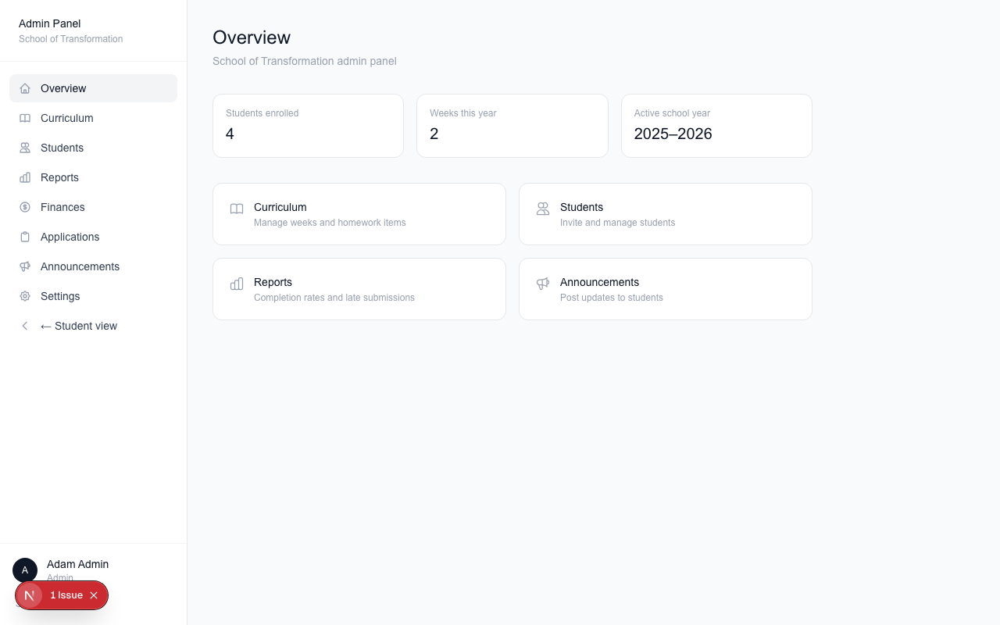
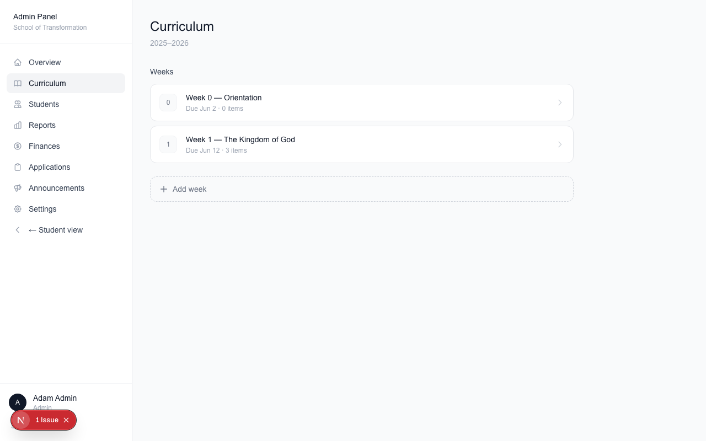
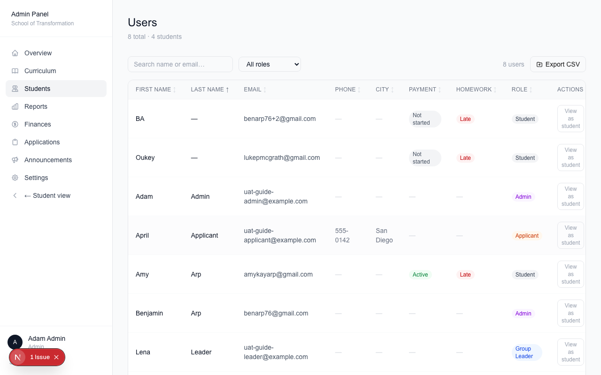
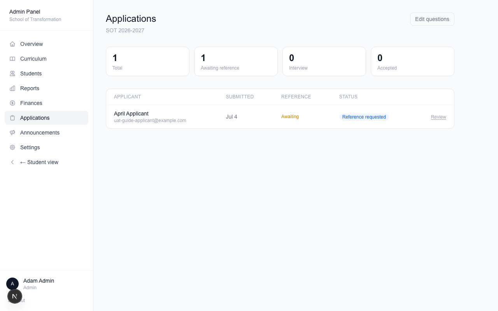
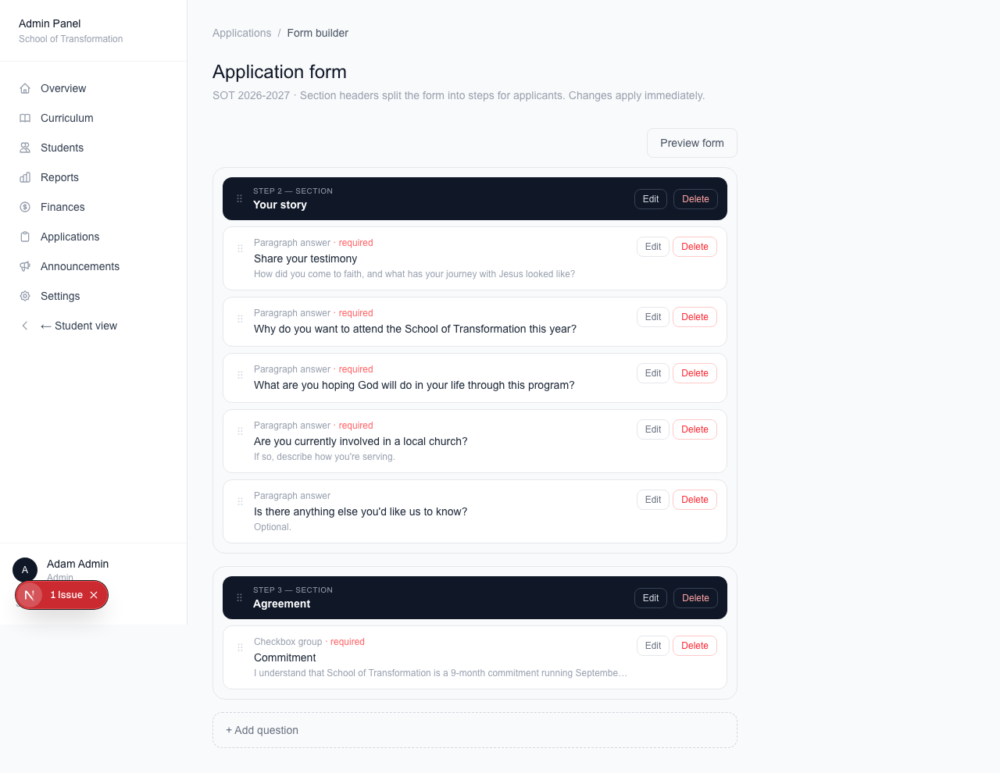
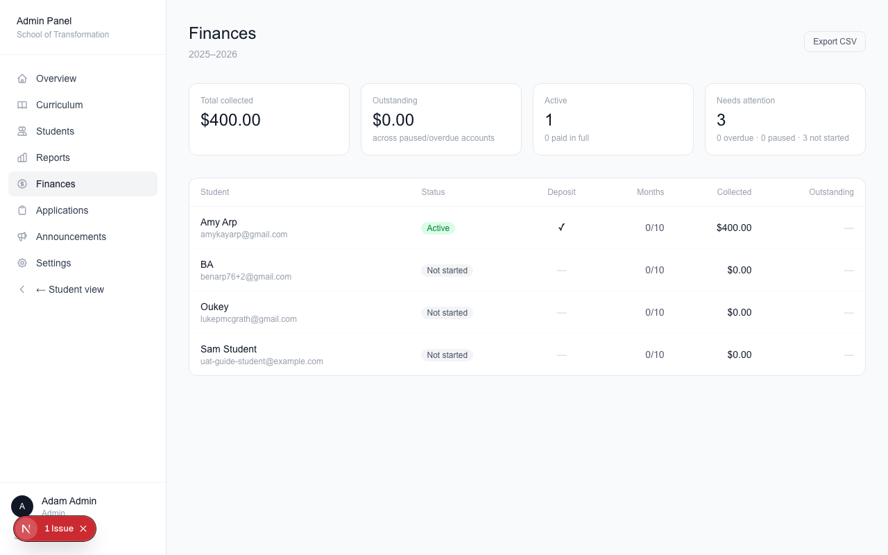
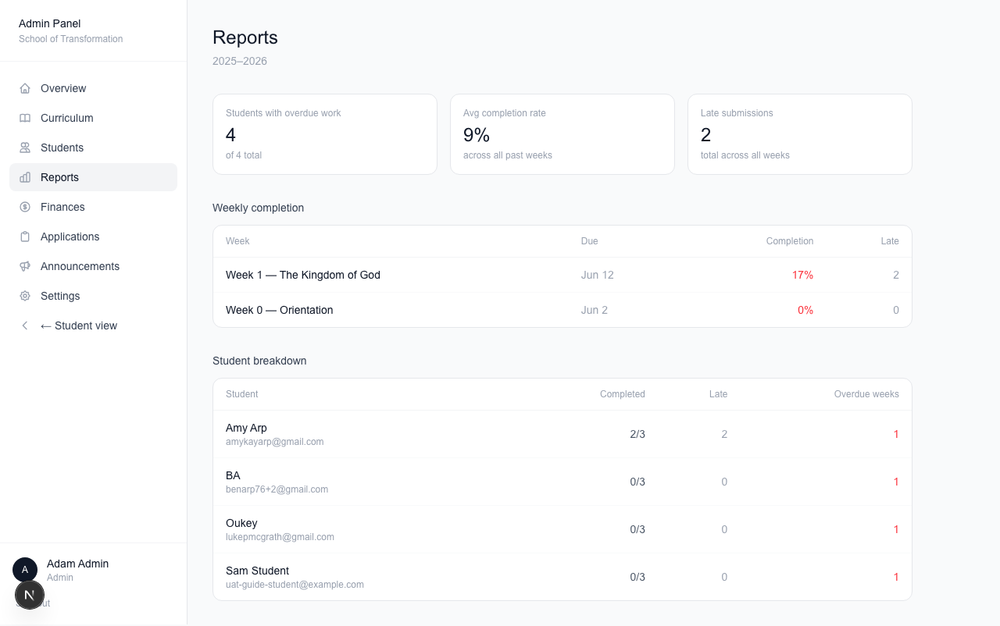
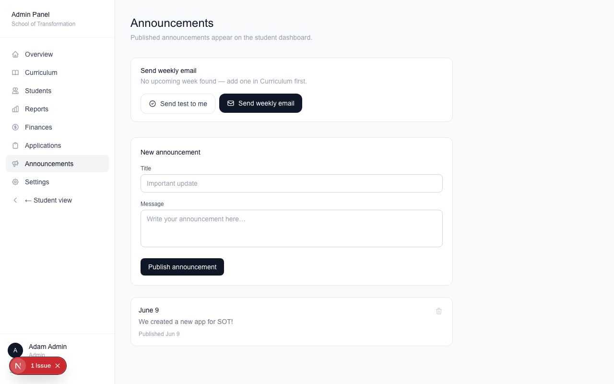
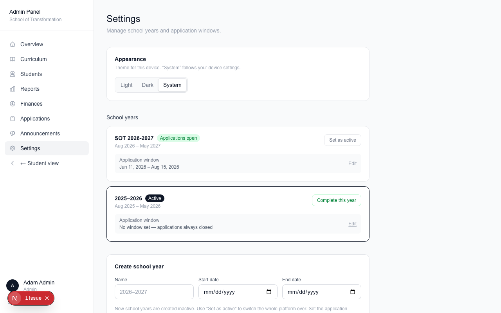

# Admin Guide — School of Transformation Portal

This guide covers everything an admin can do. Each section matches a
page in the left menu of the Admin Panel.

## Curriculum — set up the year's homework

**Curriculum** is where you build each week.

- Add a week with a number, a title, and a due date.
- Open a week to add homework items. There are four kinds:
  - **Scripture Reading** — with a day-by-day reading list
  - **Book Reading** — same idea, for books
  - **Video** — paste a YouTube or Vimeo link and it plays in the app
  - **Reflection** — a question students answer in writing
- You can edit or delete items. If students have already completed an
  item, the portal will not let you delete it — edit it instead. This
  protects their records.

## Students — manage people

**Students** lists every account.

From here you can:

- Sort, filter, and export the list to a spreadsheet (CSV)
- Click a person to edit their name or email, change their role,
  put them in a group, or turn their account off
- **View as** a student to see exactly what they see (a banner
  reminds you while you do)
- **Add student** — two choices:
  - **Send an invite email** — they get a link to set a password
  - **Create account only (transfer)** — for students moving from
    another system. No email is sent. They sign in later using
    **Forgot password?** with their same email.

## Applications — review new applicants

**Applications** shows everyone applying for the next year.

Each application moves through stages:

1. **Reference requested** — the applicant finished their questions
   and we are waiting on their pastor
2. **Interview** — the reference came in (this happens by itself), or
   you moved them ahead by hand
3. **Accepted** or **Not accepted** — your call, made on their page

Good to know:

- To skip a reference, open the application and click **Move to
  interview without reference**. You must write a note saying why.
  The note is saved on the application.
- **Accept** appears when they reach the Interview stage. Accepting
  sends them an email with a tuition payment link.
- Accepted applicants do NOT get into the student portal yet. They
  pay their deposit first, and they become students when you activate
  their school year.

### Editing the application form

Click **Edit questions** to open the form builder.

- Every dark bar is a **section**. Each section is one step of the
  application.
- Add questions of any kind: short answer, paragraph, yes/no,
  dropdown, checkboxes, or a note.
- Drag the ⠿ handle to move a question, even into another section.
- **Branching**: a question can hide until an earlier answer matches.
  For example, "Which school did you finish?" only shows if they
  answered "Yes" to finishing a school.
- Click **Preview form** to see the form exactly as applicants do.
  Nothing you type in the preview is saved.

## Finances — the money picture

**Finances** shows tuition across the whole year.

- Cards at the top: total collected, what's still owed, and who
  needs attention
- The table shows each student's deposit, months paid, and balance
- **Export CSV** downloads it for a spreadsheet

To manage one student's billing, open their page in **Students** and
use the **Billing** panel. There you can pause, resume, apply a
credit or scholarship (a note is required), cancel, or refund a
charge. Every action is recorded.

## Reports — homework at a glance

**Reports** shows completion for the whole school.

- Cards show who is behind and the average completion rate
- Click any week's name to open a full table: one row per student,
  one column per homework item, with reflection answers right in the
  table. Use your browser's Find (Cmd+F) to jump to a name fast.

## Announcements — talk to everyone

**Announcements** posts a note to every student's dashboard. This is
also where you send the **weekly email** — it goes to all enrolled
students with next week's homework. Send a **test to yourself**
first to see how it looks.

## Settings — school years

**Settings** is where school years live.

- Create a year, set its application window (when people can apply)
- **Set as active** — flips the whole portal to that year. This is
  also the moment accepted applicants **who paid their deposit**
  become students.
- **Complete this year** — moves all students to alumni at year end.
  There is a **Reopen** button if you clicked it by mistake.
- The **Appearance** card sets light or dark mode for your device.

## Need help?

The technical docs live in the `docs/` folder of the project, and
`docs/uat.md` has a full checklist for testing every feature.
