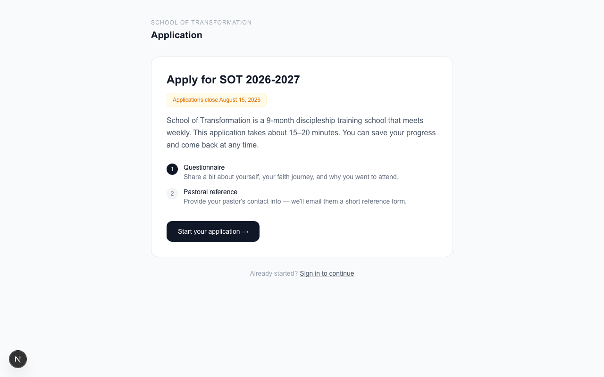
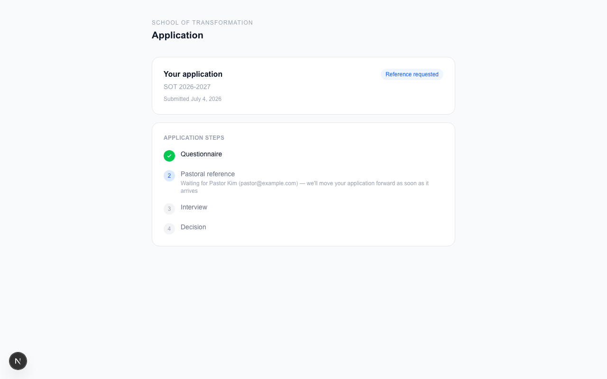
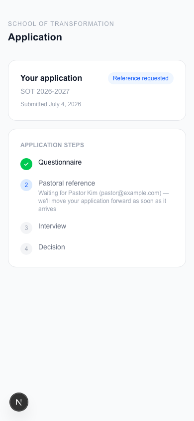

# Applying to the School of Transformation

Welcome! This guide shows you how to apply, step by step.

You can apply from a computer or from your phone. It looks a little
different on each, but the steps are the same.

## 1. Start your application

Go to the school's website and open the **Apply** page.

Click **Start your application**. You will make an account with your
email and a password. Write your password down somewhere safe — you
will use it to check on your application later.

## 2. Answer the questions

The application is split into a few short steps. A bar at the top
shows how far along you are.

- Fill in your name, phone number, and city first.
- Then answer the questions on each page.
- Questions with a red star (*) must be answered.
- Click **Continue** to go to the next step. Click **Back** if you
  want to change something.

**Your answers save by themselves.** You will see "Saved
automatically" at the top. That means you can close the page and come
back later — your answers will still be there. Take your time.

When you finish the last step, click **Submit application**.

## 3. Tell us about your pastor

After you submit your answers, we ask for one more thing: a reference
from a pastor who knows you.

Type in your pastor's name, email, and church. We will email your
pastor a short form to fill out. You don't have to do anything else —
we'll take it from here.

## 4. Check on your application

Any time you log in, you will see your application status page. It
shows each step and where you are.

On your phone it looks like this:

Here is what the stages mean:

| Stage | What it means |
|---|---|
| **Reference requested** | We are waiting to hear from your pastor. |
| **Interview** | Your reference came in. We will reach out to set up a talk with you. |
| **Accepted** | You're in! 🎉 |

## 5. If you are accepted

When you are accepted, you will get an email, and your status page
will show one thing to do: **set up your tuition payment**.

Tuition is **$2,400** for the year. You pay a **$400 deposit** first.
Then you pay **$200 a month for 10 months**. The payments stop by
themselves after the 10th month.

Click **Set up tuition payment** and enter your card. Payment is
handled by Stripe, a trusted payment company. We never see your card
number.

Once your deposit is in, your spot is saved. You will get full access
to the student portal when the school year starts.

## Need help?

Email the school office. We are happy to help with any step.
