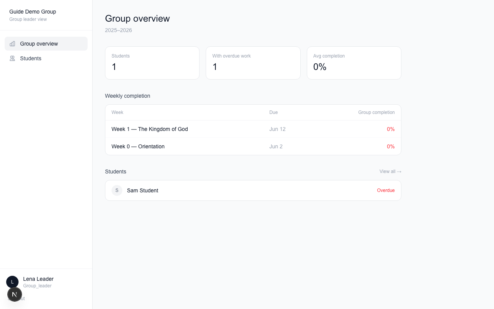
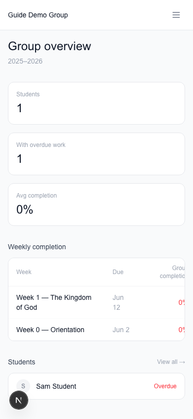
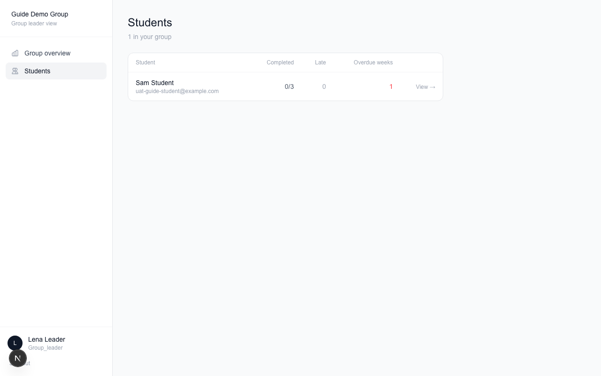

# Group Leader Guide — School of Transformation Portal

Thank you for leading a group! This guide shows you how to keep up
with your students in the portal.

## What you can see

As a group leader, you see **your group only**. You can see how your
students are doing on their homework. You cannot change their work —
the portal is a window, not a red pen.

## Signing in

Sign in on the school website with your email and password. You will
land on your leader home page.

On your phone:

## Checking on your students

Click **Students** to see everyone in your group.

Click a student's name to see their week-by-week progress:

- **Complete** — they finished everything that week
- **Incomplete** — the week is past due and something is missing
- Each item shows if it was done on time or late

## How to use this

A quick look before your group meets tells you who might need a
nudge or some encouragement. If someone is falling behind, reach out
— a kind word goes a long way.

## What to do if something looks wrong

If a student says they did the work but it doesn't show, have them
check that they tapped the circle to mark it complete. If it still
looks wrong, email the school office.

## Need help?

Email the school office any time.
