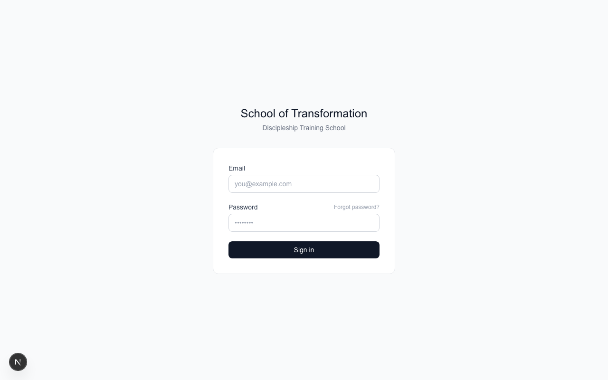
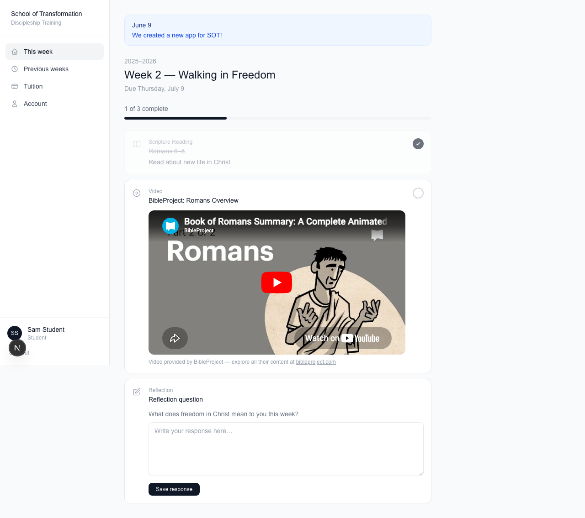
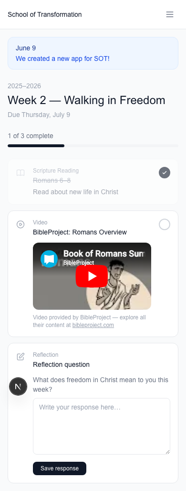
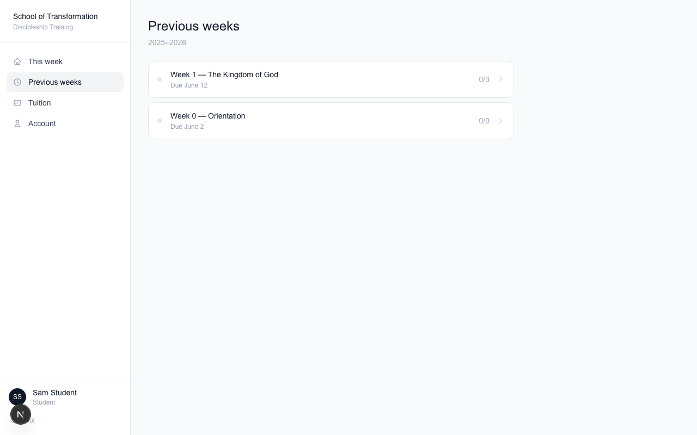
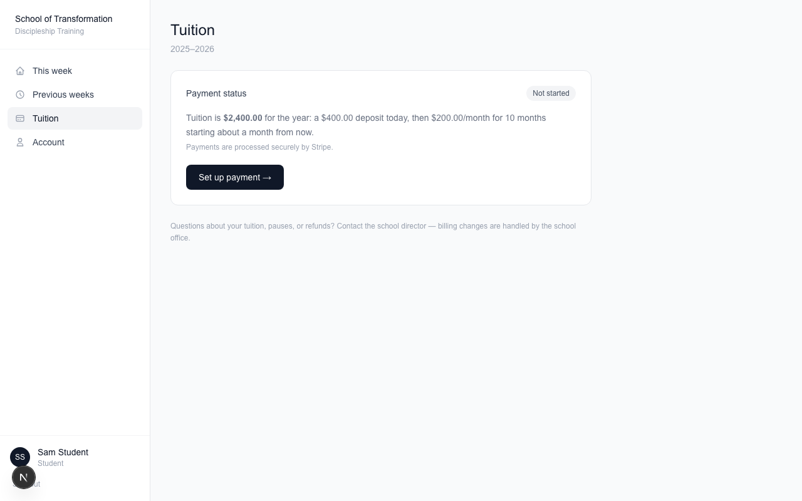
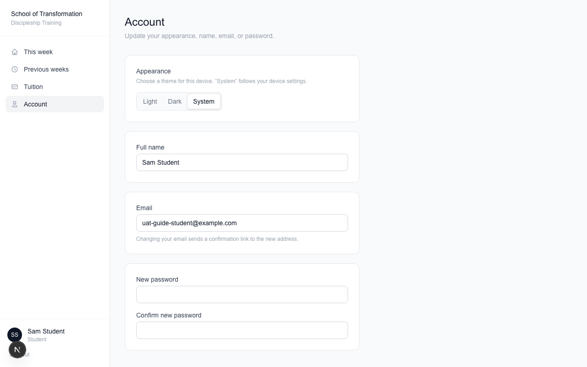

# Student Guide — School of Transformation Portal

This guide shows you how to use the student portal. You can use it on
a computer or on your phone.

## Signing in

Go to the school website and sign in with your email and password.

Forgot your password? No problem. Click **Forgot password?** and we
will email you a link to make a new one.

> **New here from another system?** Your account is already set up
> with the same email you used before. Just click **Forgot password?**
> the first time, and set a password. That's it — you're in.

## This Week — your homework

When you sign in, you land on **This Week**. It shows everything due
this week.

On your phone:

Here is how it works:

- The bar near the top shows how much you have finished.
- **Reading items**: read, then tap the circle to check it off.
- **Videos**: watch right on the page, then check it off.
- **Reflection questions**: type your answer in the box and press
  **Save response**. Saving your answer checks it off for you.
- Checked something by mistake? Tap the circle again to un-check it.

Notes from the school (announcements) show at the top in blue.

## Previous weeks — catch up any time

Click **Previous weeks** to see every past week.

Missed something? You can still do it. Open the week and finish the
item — it will be marked "Submitted late," but done is better than
not done!

## Tuition — see your payments

Click **Tuition** to see where your payments stand.

You can see:

- If your deposit is paid
- How many monthly payments you have made (out of 10)
- Your next payment date and amount
- When your final payment will be

Got a new card? Click **Update card on file**. Questions about
pausing or refunds? Talk to the school office — they handle those.

## Account — your settings

Click **Account** to change your name, email, or password. You can
also pick **Light**, **Dark**, or **System** mode to change how the
app looks.

## Need help?

Ask your group leader or email the school office.
